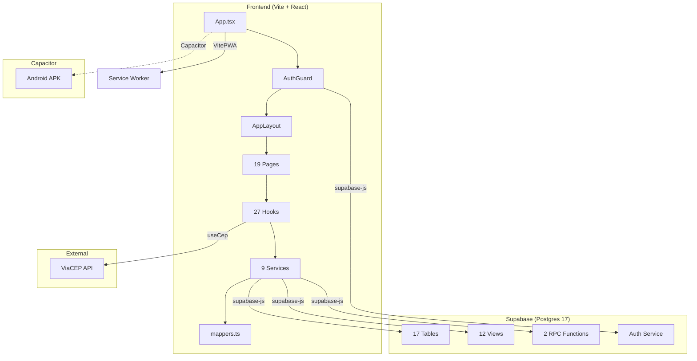

# System Architecture — Mont Distribuidora (CRM/ERP)

**Data:** 2026-02-21  
**Agente:** @architect (Brownfield Discovery — FASE 1)  
**Projeto:** distribuidora-prod (`herlvujykltxnwqmwmyx`)

---

## 1. Stack Tecnológico

| Camada | Tecnologia | Versão |
|--------|-----------|--------|
| **Runtime** | Vite | 7.2 |
| **UI Framework** | React | 19.2 |
| **Linguagem** | TypeScript | 5.9.3 (strict mode) |
| **Styling** | Tailwind CSS | 3.4.18 |
| **State (server)** | TanStack React Query | 5.90 |
| **State (client)** | Zustand | 5.0 |
| **Forms** | React Hook Form + Zod | 7.68 / 4.1 |
| **Routing** | React Router DOM (HashRouter) | 7.10 |
| **Animation** | Framer Motion | 12.23 |
| **Icons** | lucide-react | 0.556 |
| **Backend** | Supabase (Postgres 17.6, Auth, Storage) | JS SDK 2.95 |
| **Mobile** | Capacitor (Android) | 8.0 |
| **PWA** | vite-plugin-pwa | 1.2 |
| **Testing** | Vitest + Testing Library + jsdom | 4.0 / 16.3 |
| **Deploy** | Vercel | — |

### Dependências Notáveis
- `@react-three/fiber` + `@react-three/drei` + `three` — 3D (aparentemente não utilizado no fluxo principal)
- `class-variance-authority` + `clsx` + `tailwind-merge` — composição de classes (padrão shadcn/ui)
- `leva` — debug panel para Three.js
- `date-fns` — manipulação de datas

---

## 2. Estrutura de Pastas

```
src/
├── App.tsx                    # Root: HashRouter + Routes + AuthGuard
├── main.tsx                   # Entry: React.createRoot
├── index.css                  # Design tokens (CSS vars) + Tailwind layers
├── components/
│   ├── auth/         (1)      # AuthGuard
│   ├── common/       (1)      # ErrorBoundary
│   ├── contatos/     (5)      # ContatoForm, ContatoCard, etc.
│   ├── dashboard/    (13)     # KpiCard, chart components
│   ├── features/              # Domain feature components
│   │   ├── entregas/    (6)
│   │   ├── financeiro/  (3)
│   │   ├── purchase-orders/ (3)
│   │   └── vendas/      (6)
│   ├── layout/       (5)      # AppLayout, BottomNav, Header, PageContainer
│   └── ui/           (15)     # Badge, Button, Card, Input, Modal, Select, etc.
├── hooks/            (27)     # Custom hooks (data fetching + domain logic)
├── pages/            (20)     # Route-level pages
├── services/         (9+3)    # Supabase queries + mappers + __tests__/
├── types/            (2)      # database.ts (auto-generated), domain.ts (manual)
├── schemas/          (3)      # Zod validation schemas
├── lib/              (3)      # supabase.ts, react-query.ts, utils.ts
├── stores/           (1)      # Zustand stores
├── contexts/         (1)      # React contexts
├── utils/            (4)      # General utilities
├── constants/        (2)      # App constants
└── test/             (1)      # Test setup
```

---

## 3. Rotas e Páginas

| Rota | Página | Tamanho | Descrição |
|------|--------|---------|-----------|
| `/login` | LoginPage | 7.3 KB | Autenticação Supabase |
| `/` | Dashboard | 12.8 KB | KPIs financeiros + operacionais |
| `/contatos` | Contatos | 10.5 KB | Lista CRM (FTS) |
| `/contatos/:id` | ContatoDetalhe | 40.2 KB | ⚠️ Perfil completo + histórico vendas |
| `/nova-venda` | NovaVenda | 14.2 KB | Wizard de venda (multi-step) |
| `/vendas` | Vendas | 24.4 KB | Lista vendas com filtros |
| `/vendas/:id` | VendaDetalhe | 24.9 KB | Detalhe venda + pagamentos |
| `/vendas/:id/editar` | NovaVenda | — | Edição de venda existente |
| `/ranking` | Ranking | 8.7 KB | Ranking compras + indicações |
| `/recompra` | Recompra | 15.7 KB | Alertas de recompra |
| `/produtos` | Produtos | 12.6 KB | CRUD produtos |
| `/estoque` | Estoque | 23.0 KB | Gestão de estoque |
| `/pedidos-compra` | PedidosCompra | 6.2 KB | Pedidos ao fornecedor |
| `/entregas` | Entregas | 12.9 KB | Logística de entregas |
| `/relatorio-fabrica` | RelatorioFabrica | 15.6 KB | Relatório de itens para fábrica |
| `/fluxo-caixa` | FluxoCaixa | 20.4 KB | Fluxo de caixa mensal |
| `/plano-de-contas` | PlanoDeContas | 5.1 KB | Categorias financeiras |
| `/catalogo-pendentes` | CatalogoPendentes | 7.3 KB | Pedidos catálogo online pendentes |
| `/configuracoes` | Configuracoes | 30.4 KB | ⚠️ Configurações gerais |
| `/menu` | Menu | 5.2 KB | Menu mobile |

> ⚠️ **Páginas grandes**: `ContatoDetalhe` (40 KB) e `Configuracoes` (30 KB) são candidatas a refatoração/split.

---

## 4. Database Schema (Produção)

### 4.1 Tabelas Core

| Tabela | Rows | RLS | Audit | FTS | Notas |
|--------|------|-----|-------|-----|-------|
| `contatos` | 341 | ✅ | ✅ | ✅ | CRM central. Self-ref `indicado_por_id` |
| `vendas` | 477 | ✅ | ✅ | ✅ | Link `contato_id`. Check constraints em `status`, `forma_pagamento` |
| `itens_venda` | 484 | ❌ | ❌ | ❌ | **RLS DESABILITADO** |
| `pagamentos_venda` | 73 | ❌ | ❌ | ❌ | **RLS DESABILITADO** |
| `produtos` | 10 | ✅ | ❌ | ❌ | Código único, estoque |
| `contas` | 2 | ✅ | ✅ | ❌ | Caixa, PIX, banco |
| `lancamentos` | 4 | ✅ | ✅ | ❌ | Financeiro: entrada/saída/transferência |
| `plano_de_contas` | 11 | ✅ | ❌ | ❌ | Receita/despesa, fixa/variável |
| `configuracoes` | 5 | ❌ | ❌ | ❌ | **RLS DESABILITADO**, key-value JSONB |

### 4.2 Tabelas Purchase Orders

| Tabela | Rows | RLS | Notas |
|--------|------|-----|-------|
| `purchase_orders` | 6 | ✅ | Enums `purchase_order_status`, `purchase_order_payment_status` |
| `purchase_order_items` | 13 | ✅ | `total_cost` generated column |
| `purchase_order_payments` | 8 | ✅ | Link com `lancamentos` |

### 4.3 Tabelas Catálogo Online

| Tabela | Rows | RLS | Notas |
|--------|------|-----|-------|
| `cat_pedidos` | 5 | ✅ | Pedidos online (centavos) |
| `cat_itens_pedido` | 0 | ✅ | Items do catálogo |
| `cat_imagens_produto` | 5 | ❌ | **RLS DESABILITADO** |
| `cat_pedidos_pendentes_vinculacao` | 0 | ❌ | **RLS DESABILITADO** |
| `sis_imagens_produto` | 7 | ✅ | Imagens internas |

### 4.4 Views (12 views)

| View | Propósito |
|------|-----------|
| `crm_view_monthly_sales` | KPIs mensais: faturamento, lucro, ticket médio |
| `crm_view_operational_snapshot` | Snapshot operacional: clientes ativos, entregas |
| `ranking_compras` | Ranking de compras por contato |
| `ranking_indicacoes` | Ranking de indicações |
| `view_extrato_mensal` | Extrato financeiro mensal |
| `view_fluxo_resumo` | Resumo fluxo de caixa |
| `view_home_alertas` | Alertas de recompra (dias sem compra) |
| `view_home_financeiro` | Dashboard financeiro (faturamento, lucro, a receber) |
| `view_home_operacional` | Dashboard operacional (vendas, entregas, indicações) |
| `vw_admin_dashboard` | Dashboard admin do catálogo |
| `vw_catalogo_produtos` | Produtos formatados para catálogo |
| `vw_marketing_pedidos` | Análise marketing: pedidos online vs direto |

### 4.5 Functions RPC

| Function | Args | Descrição |
|----------|------|-----------|
| `receive_purchase_order` | `p_order_id` | Recebe pedido de compra (atualiza estoque) |
| `rpc_marcar_venda_paga` | `p_venda_id`, `p_conta_id`, `p_data?` | Marca venda como paga + cria lançamento |

### 4.6 Enums

| Enum | Valores |
|------|---------|
| `purchase_order_status` | pending, received, cancelled |
| `purchase_order_payment_status` | paid, partial, unpaid |

---

## 5. Arquitetura de Dados (Frontend)

### Camada de Tipos (Dual-layer)

```
database.ts (auto-gerado pelo Supabase CLI)
    ↓ mappers.ts (snake_case → camelCase)
domain.ts (tipos de domínio manuais)
```

**Serviços** (`src/services/`):
- `vendaService.ts` — CRUD vendas + queries com joins
- `contatoService.ts` — CRUD contatos + busca FTS
- `dashboardService.ts` — Queries para views do dashboard
- `produtoService.ts` — CRUD produtos + estoque
- `purchaseOrderService.ts` — CRUD pedidos de compra
- `cashFlowService.ts` — Fluxo de caixa + extratos
- `recompraService.ts` — Alertas de recompra
- `logisticaService.ts` — Entregas
- `mappers.ts` — Mapeadores DB → Domain

**Hooks** (`src/hooks/`): ~27 hooks com TanStack Query para cache/mutations.

### Padrão de Dados

```
Supabase DB → Service (query+join) → Mapper → Domain Type → Hook (TanStack QUery) → Component
Component → Hook (mutation) → Service (insert/update) → Supabase DB
```

> ⚠️ **Débito**: Mappers usam `any` para input types em vez de tipos tipados do `database.ts`.

---

## 6. Design System

### Tokens (CSS Variables)

| Token | Light | Dark |
|-------|-------|------|
| `--background` | `#ffffff` | `#0a0f0d` (Tactical Dark) |
| `--foreground` | `#102210` | `#fafafa` |
| `--primary` | `#13ec13` (Neon Green) | `#13ec13` |
| `--accent` | `#eab308` (Gold) | `#eab308` |
| `--destructive` | `#ef4444` (Red) | `#ef4444` |
| `--card` | `#ffffff` | `#1a2620` |
| `--border` | `hsl(120 10% 90%)` | `hsl(120 28% 14%)` |
| `--radius` | `1rem` | `1rem` |

### Tipografia

- **Display/Headlines**: Lexend (300-700)
- **Body**: Noto Sans (400, 500, 700)
- Anti-aliasing habilitado

### Componentes UI (15 primitives)

Badge, Button (CVA), Card, EmptyState, FloatingDock, Input, Modal, PwaUpdateToast, Select, Skeleton, Spinner, StoryFilter, ThemeToggle, Toast, Index barrel.

---

## 7. Padrões de Código

### Positivos ✅
1. **Typed Supabase client** com generics `createClient<Database>`
2. **Domain types** separados de database types
3. **Mapper layer** para isolar schema DB do frontend
4. **ErrorBoundary** no root
5. **AuthGuard** com proteção de rotas
6. **HashRouter** para compatibilidade com Capacitor/PWA
7. **CSS Variables** para theming (dark mode toggle)
8. **FTS** (full-text search) com `tsvector` no Postgres
9. **Audit fields** (`created_by`, `updated_by`) em tabelas críticas
10. **Path alias** `@/` para imports limpos
11. **Strict TypeScript** (`strict: true`, `noUnusedLocals`, `verbatimModuleSyntax`)
12. **PWA** com service worker e prompt de update

### Negativos / Débitos Identificados ❌

| ID | Débito | Severidade | Área |
|----|--------|-----------|------|
| SYS-001 | **RLS desabilitado** em 5 tabelas (itens_venda, pagamentos_venda, configuracoes, cat_imagens_produto, cat_pedidos_pendentes_vinculacao) | 🔴 Crítica | Segurança |
| SYS-002 | **Mappers usam `any`** — sem type-safety na camada de mapeamento | 🟡 Alta | Tipagem |
| SYS-003 | **Páginas monolíticas** — ContatoDetalhe (40KB), Configuracoes (30KB), Vendas (24KB) | 🟡 Alta | Manutenibilidade |
| SYS-004 | **leva (debug panel)** incluído no bundle de produção — utilizado em `Estoque.tsx` para controlar cena 3D. Candidato a envolver em `import.meta.env.DEV` guard | 🟢 Baixa | Bundle |
| SYS-005 | **Naming inconsistente** — purchase_orders (inglês) vs vendas/contatos (português) | 🟢 Baixa | Consistência |
| SYS-006 | **Cobertura de testes limitada** — 17 testes unitários passando em `services/__tests__/`, mas sem cobertura de hooks, componentes ou E2E | 🟢 Média | Qualidade |
| SYS-007 | **`leva`** (debug panel) no bundle de produção | 🟢 Baixa | Bundle |
| SYS-008 | **Sem error tracking** — Sentry configurado no .env mas não integrado | 🟡 Média | Observabilidade |
| SYS-009 | **Duplicação imagens** — `sis_imagens_produto` (interno) + `cat_imagens_produto` (catálogo) | 🟢 Média | Schema |
| SYS-010 | **Sem soft deletes** — deletes são hard deletes diretos | 🟡 Alta | Dados |
| SYS-011 | **contatos.origem check constraint** tem `'Catálogo Online'` (com acento) vs domain type usa `'catalogo'` (sem acento) | 🟡 Alta | Integridade |

---

## 8. Integrações e Pontos de Conexão



---

## 9. Deploy e Configuração

| Item | Valor |
|------|-------|
| **Hosting** | Vercel (`vercel.json` presente) |
| **Base URL** | `/` |
| **Dev Server** | `localhost:5173` com polling (WSL compat) |
| **API Proxy** | `/api` → `http://127.0.0.1:5000` |
| **Environment** | `VITE_SUPABASE_URL`, `VITE_SUPABASE_ANON_KEY` |
| **Build** | `tsc -b && vite build` |
| **PWA** | Prompt update, workbox cache 3MB max |
| **Mobile** | Capacitor Android (Android folder presente) |

---

## 10. Resumo de Volume (Produção)

| Métrica | Valor |
|---------|-------|
| Contatos cadastrados | 341 |
| Vendas registradas | 477 |
| Itens de venda | 484 |
| Pagamentos | 73 |
| Produtos ativos | 10 |
| Pedidos catálogo | 5 |
| Pedidos compra (fornecedor) | 6 |
| Lançamentos financeiros | 4 |
| Contas financeiras | 2 |
| Categorias plano de contas | 11 |

---

*Gerado por @architect como parte do workflow brownfield-discovery FASE 1*
