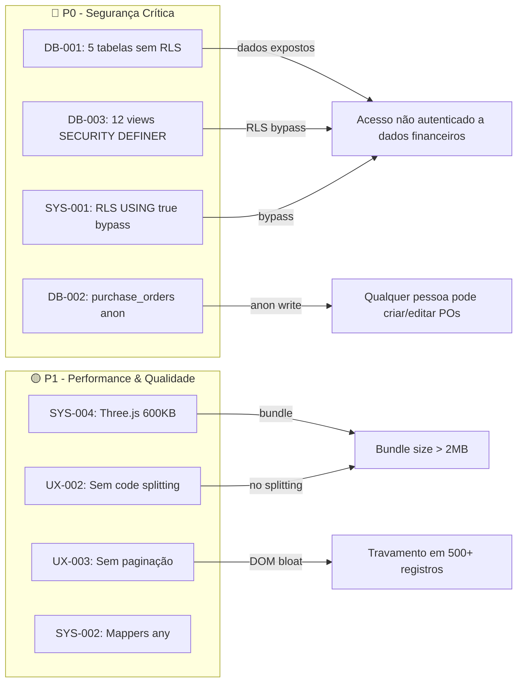

# Technical Debt Assessment — Mont Distribuidora

**Data:** 2026-02-21  
**Workflow:** brownfield-discovery (FASES 1-10)  
**Projeto:** distribuidora-prod (`herlvujykltxnwqmwmyx`)

---

## Resumo Executivo

| Métrica | Valor |
|---------|-------|
| **Total de débitos** | 34 |
| **Críticos (P0)** | 4 |
| **Altos (P1)** | 14 |
| **Médios (P2)** | 11 |
| **Baixos (P3)** | 5 |
| **Esforço total estimado** | ~59h |
| **Supabase Security Lints** | 17 ERRORs + 24 WARNs |
| **Supabase Performance Lints** | 32 INFOs/WARNs |

> 📄 Relatórios detalhados: [system-architecture.md](file:///d:/1.%20LUCCAS/aplicativos%20ai/distribuidora/docs/architecture/system-architecture.md) · [DB-AUDIT.md](file:///d:/1.%20LUCCAS/aplicativos%20ai/distribuidora/supabase/docs/DB-AUDIT.md) · [frontend-spec.md](file:///d:/1.%20LUCCAS/aplicativos%20ai/distribuidora/docs/frontend/frontend-spec.md)

---

## Stack Atual

| Camada | Tecnologia | Versão |
|--------|-----------|--------|
| Build | Vite | 7.2 |
| UI | React | 19.2 |
| Styling | Tailwind CSS | 3.4 |
| Server State | TanStack Query | 5.90 |
| Client State | Zustand | 5.0 |
| Forms | React Hook Form + Zod | 7.68 / 4.1 |
| Routing | React Router DOM (HashRouter) | 7.10 |
| Backend | Supabase (Postgres 17.6) | JS SDK 2.95 |
| Mobile | Capacitor (Android) | 8.0 |
| PWA | vite-plugin-pwa | 1.2 |
| Testing | Vitest | 4.0 |

**Produção:** 341 contatos · 477 vendas · 10 produtos · 17 tabelas · 12 views · 2 RPCs

---

## Catálogo Completo de Débitos

### 🔴 P0 — Crítico (resolver antes de qualquer feature)

| ID | Débito | Área | Esforço |
|----|--------|------|---------|
| DB-001 | **RLS desabilitado** em 5 tabelas: `itens_venda`(484 rows), `pagamentos_venda`(73), `configuracoes`(5), `cat_imagens_produto`(5), `cat_pedidos_pendentes_vinculacao`(0) | Segurança | 2h |
| DB-002 | **Purchase orders acessíveis para anon** — `purchase_orders`, `purchase_order_items`, `purchase_order_payments` têm policies `USING(true)` para **todos os roles** incluindo anon | Segurança | 3h |
| DB-003 | **12 views com SECURITY DEFINER** — executam com permissões do criador, bypassando RLS | Segurança | 4h |
| SYS-001 | **RLS bypass sistêmico** — tabelas com RLS ativado usam `USING(true)`: contatos, vendas, produtos, contas, lancamentos, plano_de_contas | Segurança | 3h |

**Subtotal P0: ~20h**

---

### 🟡 P1 — Alto (próxima sprint)

| ID | Débito | Área | Esforço |
|----|--------|------|---------|
| DB-004 | **9 functions sem `search_path` fixo** — vulnerável a search_path injection | Segurança | 2h |
| DB-005 | **Leaked password protection OFF** no Supabase Auth | Segurança | 0.5h |
| DB-010 | **Check constraint `origem`** usa `'Catálogo Online'` (com acento) vs domain type `'catalogo'` | Integridade | 1h |
| SYS-002 | **Mappers usam `any`** — sem type-safety na camada de mapeamento DB→Domain | Tipagem | 4h |
| SYS-003 | **Páginas monolíticas** — ContatoDetalhe (39KB), Configuracoes (30KB), VendaDetalhe (24KB), Vendas (24KB) | Manutenibilidade | 6h |
| SYS-004 | **Three.js + leva no bundle** (~600KB) — utilizado ativamente em `Estoque.tsx` (visualização 3D geladeira). `leva` é debug panel — candidato a tree-shake em prod | Performance | 2h |
| UX-001 | **Zero acessibilidade** — 1 `aria-label` em todo o app, 0 `role=`, sem focus trap em modais | A11y | 8h |
| SYS-010 | **Sem soft deletes** — hard deletes diretos, sem recuperação | Dados | 4h |
| UX-002 | **Sem code splitting** — bundle monolítico, zero `React.lazy()` | Performance | 3h |
| UX-003 | **Sem paginação / virtual scroll** — 477 vendas e 341 contatos renderizados de uma vez | Performance | 4h |
| UX-004 | **Apenas 3/19 páginas responsivas** — sem breakpoints lg:/xl: na maioria | Responsive | 6h |
| UX-005 | **Páginas monolíticas** (= SYS-003, perspectiva UX) | Manutenibilidade | — |
| UX-009 | **Sem Pagination component** | UX | 2h |
| UX-010 | **Primary color #13ec13** pode falhar contraste WCAG AA em fundo branco | A11y | 1h |
| SYS-011 | **Constraint `origem` com acento** (= DB-010, perspectiva sistema) | Integridade | — |

**Subtotal P1: ~34.5h** (excluindo duplicados)

---

### 🟢 P2 — Médio (backlog sprint seguinte)

| ID | Débito | Área | Esforço |
|----|--------|------|---------|
| DB-006 | **8 FKs de audit fields sem índice** (created_by, updated_by) | Performance | 1h |
| DB-007 | **2 índices duplicados** (itens_venda, vendas) | Performance | 0.5h |
| DB-008 | **RLS InitPlan** — policies cat_pedidos/cat_itens_pedido re-avaliam auth() por row | Performance | 0.5h |
| DB-009 | **Policies duplicadas** em sis_imagens_produto (4 pares) | Performance | 1h |
| SYS-006 | **Cobertura de testes limitada** — 17 testes unitários em services/__tests__/, sem cobertura de hooks/componentes/E2E | Qualidade | 8h |
| SYS-008 | **Sem error tracking** — Sentry no .env mas não integrado | Observabilidade | 2h |
| SYS-009 | **Duplicação imagens** — `sis_imagens_produto` + `cat_imagens_produto` | Schema | 3h |
| UX-006 | **`window.confirm()` para deletes** — sem ConfirmDialog | UX | 2h |
| UX-007 | **Inputs de data nativos** — sem DatePicker consistente | UX | 3h |
| UX-008 | **Sem Combobox/Autocomplete** component | UX | 3h |
| UX-012 | **BottomNav oculta "Vendas"** na rota /nova-venda | Nav | 1h |

**Subtotal P2: ~25h**

---

### ⚪ P3 — Baixo (evolução contínua)

| ID | Débito | Área | Esforço |
|----|--------|------|---------|
| SYS-005 | **Naming inconsistente** PT vs EN (purchase_orders vs vendas) | Consistência | 4h |
| SYS-007 | **`leva`** (debug panel) no bundle de produção | Bundle | 0.5h |

| DB-011 | **Naming inconsistente** nas tabelas (= SYS-005) | Consistência | — |
| DB-012 | **Audit fields faltantes** em produtos, itens_venda, pagamentos_venda, purchase_orders, cat_pedidos | Auditoria | 2h |
| UX-011 | **Sem `prefers-reduced-motion`** para framer-motion | A11y | 1h |

**Subtotal P3: ~9.5h**

---

## Mapa de Riscos

---

## Proposta de Sprint Planning

### Sprint S-SEGURANÇA (P0) — ~20h / 3 dias

| Story | Descrição | Esforço |
|-------|-----------|---------|
| SEC-001 | Habilitar RLS + policies `auth.role() = 'authenticated'` em 5 tabelas | 2h |
| SEC-002 | Corrigir policies purchase_orders: restringir de anon para authenticated | 3h |
| SEC-003 | Recriar 12 views como SECURITY INVOKER | 4h |
| SEC-004 | Substituir `USING(true)` por `auth.role() = 'authenticated'` em 6 tabelas | 3h |
| SEC-005 | Fix search_path em 9 functions | 2h |
| SEC-006 | Ativar leaked password protection | 0.5h |
| SEC-007 | Fix constraint `origem` (Catálogo Online → catalogo) | 1h |
| SEC-008 | Testar todas as queries com role anon e authenticated | 4h |

### Sprint S-PERFORMANCE (P1) — ~20h / 3 dias

| Story | Descrição | Esforço |
|-------|-----------|---------|
| PERF-001 | Remover Three.js + leva do bundle | 1h |
| PERF-002 | Code splitting com React.lazy para todas as rotas | 3h |
| PERF-003 | Paginação server-side em vendas e contatos | 4h |
| PERF-004 | Tipar mappers (substituir `any` por tipos database.ts) | 4h |
| PERF-005 | Split ContatoDetalhe em sub-componentes | 3h |
| PERF-006 | Split Configuracoes em tabs | 3h |
| PERF-007 | Índices duplicados + FKs audit sem índice | 2h |

### Sprint S-UX (P2) — ~15h / 2 dias

| Story | Descrição | Esforço |
|-------|-----------|---------|
| UX-S001 | Criar ConfirmDialog component | 2h |
| UX-S002 | Criar Pagination component + integrar em listas | 3h |
| UX-S003 | Adicionar breakpoints responsivos (lg:/xl:) em 16 páginas | 6h |
| UX-S004 | Auditar e corrigir contraste primary color | 1h |
| UX-S005 | Limpar policies duplicadas sis_imagens_produto | 1h |
| UX-S006 | Integrar Sentry | 2h |

### Backlog (P3)

- Naming convention unificada PT→EN
- Audit fields em tabelas faltantes
- DatePicker, Combobox components
- prefers-reduced-motion
- Expand test coverage (hooks, components, E2E)
- Migrations versionadas no Git

---

## QA Checklist (Fase 7)

| Área | Verificação | Status Atual |
|------|------------|-------------|
| **Testes Unitários** | 17 testes passando em services/__tests__/ | ✅ Funcional |
| **Type Safety** | `tsc --noEmit` passa sem erros | ✅ Funcional |
| **Build** | `vite build` produz bundle válido | ✅ Funcional |
| **Lint** | ESLint configurado | ✅ Funcional |
| **E2E** | Zero testes E2E | 🔴 Gap |
| **Component Tests** | Zero testes de componente | 🟡 Gap |
| **Visual Regression** | Sem tooling | 🟡 Gap |
| **Performance Profiling** | Sem Lighthouse CI | 🟡 Gap |
| **Security Scan** | Supabase Advisor (73 lints) | 🔴 Lints ativos |
| **PWA Audit** | PWA funcional com prompt update | ✅ Funcional |
| **Mobile** | Capacitor Android configurado | ✅ Funcional |

---

## Referência Rápida

| Documento | Caminho |
|----------|---------|
| System Architecture | `docs/architecture/system-architecture.md` |
| Database Audit | `supabase/docs/DB-AUDIT.md` |
| Frontend/UX Spec | `docs/frontend/frontend-spec.md` |
| **Este relatório** | `docs/prd/technical-debt-FINAL.md` |

---

*Relatório consolidado — Brownfield Discovery completo (FASES 1-10)*  
*Diagnóstico finalizado em 2026-02-21 por @architect, @data-engineer, @ux-design-expert, @qa, @analyst, @pm*
