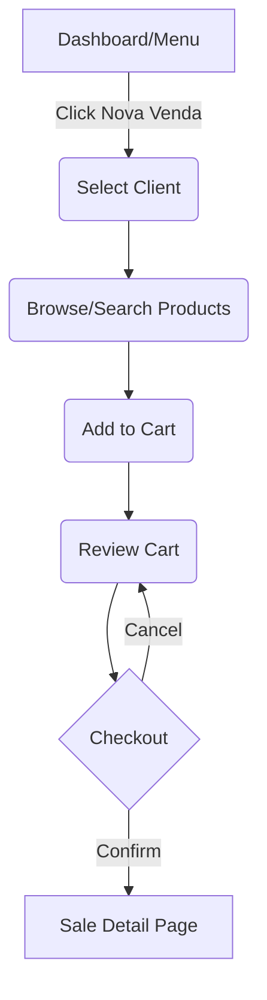
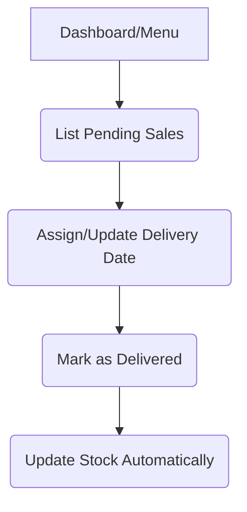
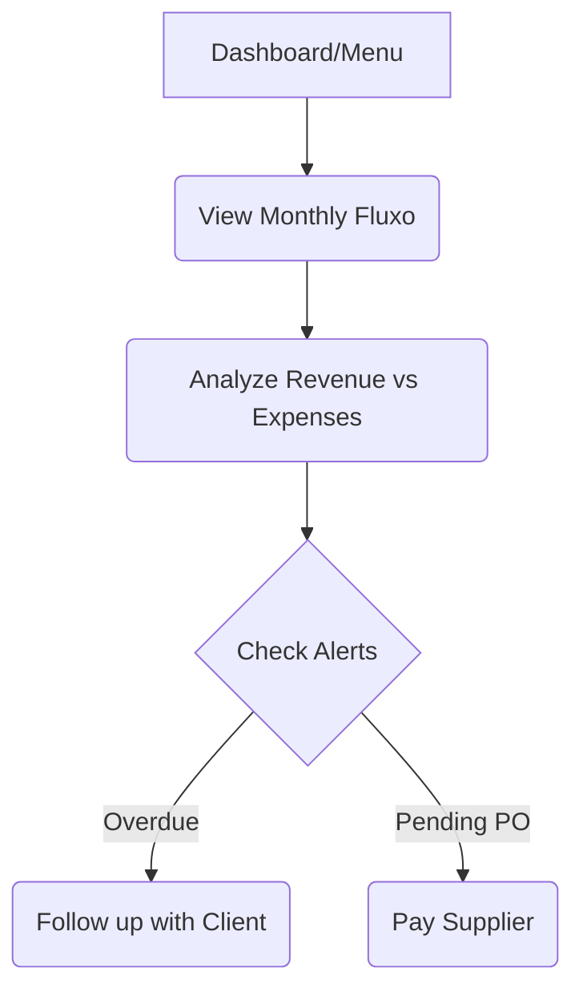
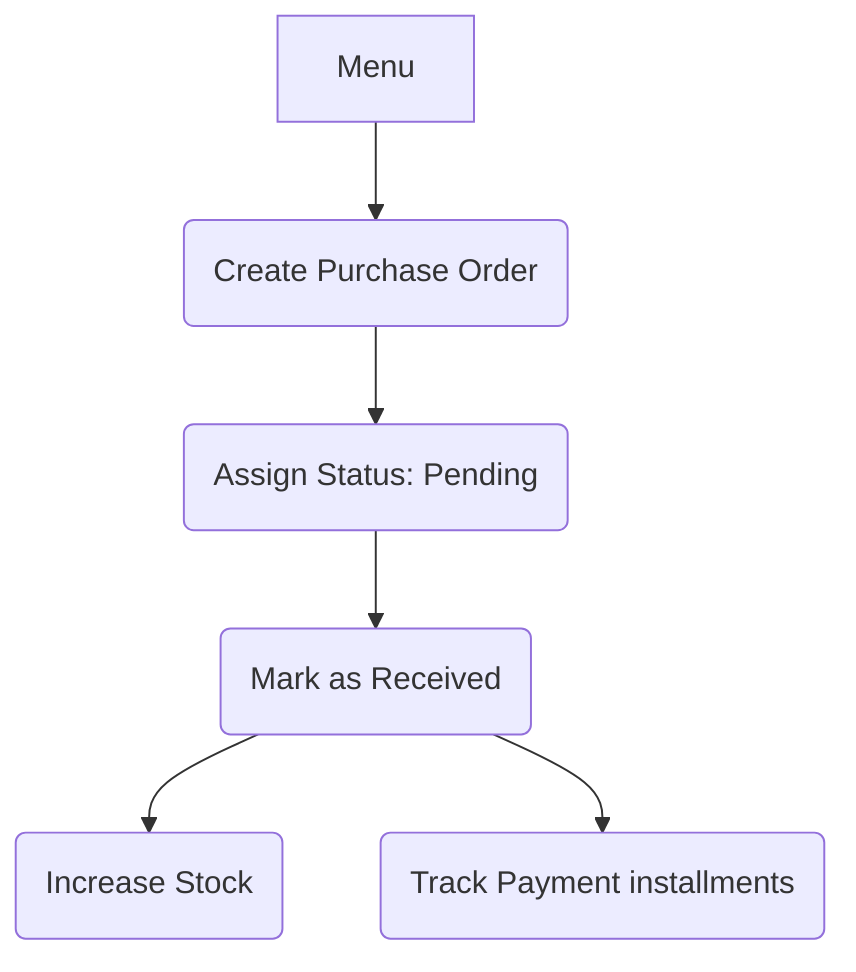

# Core User Flows - Gilmar Distribuidor Massas

## 1. Sales Flow (Nova Venda)
The primary revenue-generating flow of the application.

## 2. Fulfillment Flow (Engregas)
Managing the "Last Mile" of the distribution.

## 3. Financial Reconciliation (Fluxo de Caixa)
Managing the money coming in and out.

## 4. Purchasing Flow (Financeiro/Compras)
Replenishing the inventory.

## User Personas Impacted
1. **Admin/Owner**: Focused on Dashboard, Financial Flows, and Reports.
2. **Sales Rep**: Focused on Nova Venda and Client Management.
3. **Warehouse/Logistics**: Focused on Entregas and Stock management.
